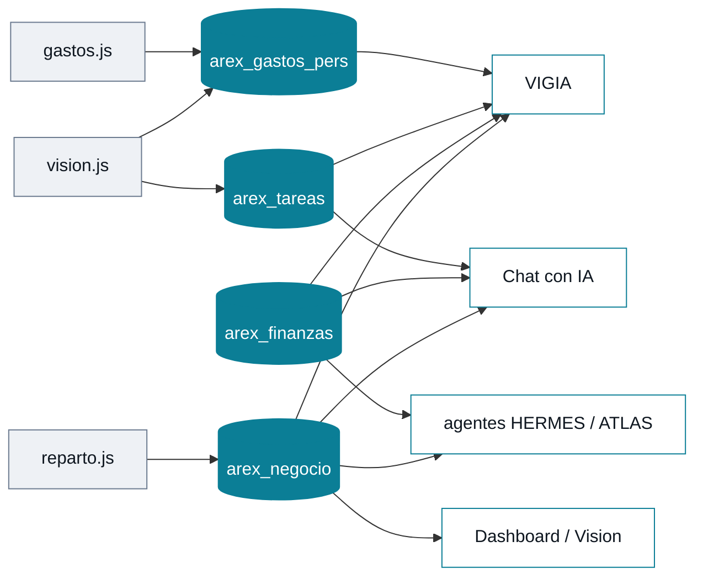

# AREX — Manual del sistema

> Mapa completo de qué tiene AREX, cómo se conecta entre sí, cómo sacarle uso real
> y qué se puede mejorar. **Cada dato salió del código, no de la memoria.**
>
> Versión documentada: **v208** · 33,571 líneas · 30 archivos JS · 14 módulos ·
> 5 agentes · 39 cruces de datos verificados · costo mensual: **$0**

---

## 1 · Qué tienes

Seis bloques temáticos. Todo en HTML, CSS y JavaScript puro: sin frameworks, sin
compilación, instalable como app y funcional sin internet.

### Núcleo de inteligencia
| Componente | Qué hace |
|---|---|
| Chat (GPT-OSS 120B) | Conversación con **todo tu contexto vivo** inyectado: finanzas, negocio, metas, tareas, memoria. Cascada automática a Llama-3.3 → 3.1 si un modelo se retira |
| `/profundo` (Gemini 2.5 Pro) | Razonamiento pesado bajo demanda. 10-30 s porque razona de verdad. Cuota diaria limitada → nunca se dispara solo |
| [`memoria.js`](memoria.js) | Memoria permanente + hechos que AREX aprende solo; se inyectan al prompt por relevancia |
| [`search.js`](search.js) | Búsqueda global (Cmd+K) sobre 8 fuentes simultáneas |

### Capital · el dinero
| Módulo | Qué hace |
|---|---|
| [`negocio.js`](negocio.js) | Frijol mayocoba: inventario en kg, ventas por medio litro, sucursales en contado o **consignación**, entregas con existencia por tienda y alerta de resurtido, meta mensual |
| [`reparto.js`](reparto.js) | Mapa 3D con tus tiendas. Registro de entregas desde el popup, **optimización del orden de paradas**, ruta solo-resurtir, navegación en Google Maps/Waze |
| [`finanzas.js`](finanzas.js) + [`finanzas-data.js`](finanzas-data.js) | Tarjetas, próximos pagos, simulador de liquidación, calculadora de 5 pestañas y **capital en la calle** (entregado sin cobrar) |
| [`gastos.js`](gastos.js) | Gasto personal por categoría vs presupuesto. Se alimenta también desde la cámara (foto del ticket) |

### Impulso · productividad
| Módulo | Qué hace |
|---|---|
| [`tareas.js`](tareas.js) | Prioridad, fecha, subtareas, recurrencia, orden automático por urgencia |
| [`metas.js`](metas.js) | Objetivos con progreso numérico o porcentual y fecha límite |
| [`agenda.js`](agenda.js) | Calendario que **agrega solo** tareas, recordatorios y metas |
| [`habitos.js`](habitos.js) | Hábitos diarios con racha y mini-calendario de 7 días |

### Mente · conocimiento
| Módulo | Qué hace |
|---|---|
| [`notas.js`](notas.js) | Notas con fijadas, colores y búsqueda; se crean también por voz |
| [`evidencias.js`](evidencias.js) | Respuestas de IA como registros permanentes. Cada corrida de agente deja tarjeta |
| [`proyectos.js`](proyectos.js) | Proyectos con fases que juntan por nombre sus tareas, metas y notas |

### Visión y AR
| Módulo | Qué hace |
|---|---|
| [`vision.js`](vision.js) | La cámara como interfaz: analiza, lee texto y recibos, identifica objetos. **Modo charla**: hablas normal, con memoria del hilo y acciones a media conversación |
| [`gesture.js`](gesture.js) | 5 señas configurables (✋ ✊ ☝ ✌ 👍), retícula orbital, swipes, pellizco |
| [`forja.js`](forja.js) | "Forja un dron" → la IA diseña el objeto 3D en vivo, anclado a tu espacio, manipulable con la mano |

### Control · centro de mando
| Componente | Qué hace |
|---|---|
| **VIGÍA** | Vigilancia proactiva que **cruza módulos** al abrir la app, sin que preguntes |
| **5 agentes** | HERMES (finanzas) · ATLAS (negocio) · SENTINEL (sistema) · SCRIBE (notas) · **ESPECTRO** (audita AREX desde adentro). Un botón los corre a todos |
| **Respaldo** | 24 claves exportables, sync a la nube, transferencia completa a otro dispositivo con un código |

---

## 2 · Cómo se conecta

**39 cruces de datos verificados en el código.** `arex_negocio` es el corazón:
casi todo lo consulta.

### Los cruces que más trabajan por ti

| Cruce | Qué hace |
|---|---|
| `reparto → negocio` | El popup de cada tienda muestra su existencia real y si necesita resurtido, calculado en vivo desde sus entregas y ventas (`negTiendaStats`) |
| `VIGÍA → 4 módulos` | Próximos pagos × margen × ventas de la semana → ¿te alcanza? · stock en kg × entregas del mes → ¿cubres el siguiente ciclo? |
| `negocio → finanzas` | Las ventas del mes suman a tu ingreso real; lo entregado sin cobrar aparece como capital en la calle |
| `visión → gastos` | Foto del ticket → gasto registrado en su categoría (`gpAddGastoAuto`) |
| `agenda → tareas + metas + recordatorios` | Un calendario armado de tres fuentes |
| `proyectos → tareas + metas + notas` | Cada proyecto junta por nombre lo relacionado |
| `control → todo` | Único módulo que escribe claves de todos los demás: respaldo, importación, sync forzada |

### Islas del sistema

- **`habitos.js`** — completamente aislado: ningún agente lo mira, no está en la
  búsqueda global ni en la agenda, y no expone getter para que otros lo consulten.
- **`agenda.js`** — no conoce hábitos, proyectos ni tus **pagos de tarjeta**, aunque
  `obtenerProximosPagos()` ya existe y encajaría como evento.
- **`search.js`** — no indexa negocio, reparto, hábitos, recordatorios ni memoria.

---

## 3 · Cómo usarlo de verdad

| Momento | Qué hacer |
|---|---|
| **Al despertar** (30 s) | Abre y lee. El VIGÍA ya revisó tus módulos: si algo es crítico te lo dice sin preguntar. El dashboard da negocio, finanzas, clima y pendientes de un vistazo |
| **Antes de repartir** | REPARTO → `🔥 SOLO RESURTIR` (solo tiendas que necesitan) → `⚡ OPTIMIZAR` (orden más corto, te dice cuántos km ahorras) → `▶ NAVEGAR` |
| **En la calle** | Toca la tienda en el mapa y registra la entrega ahí. Para gastos: foto del ticket. Con manos ocupadas: enciende el micrófono y **habla normal**, sin decir "AREX" |
| **Decisiones difíciles** | `/profundo <pregunta>` → Gemini 2.5 Pro con todo tu contexto. Medio minuto, pero razona en serio |
| **Semanal** (1 min) | CTRL → AGENTES → `⚡ BARRIDO TOTAL`. Los 5 agentes reportan a Evidencias; ESPECTRO audita el sistema por dentro |

**Tres atajos infrautilizados:** `Cmd+K` (busca en 8 fuentes) · decir
**"recuerda que…"** (guarda un hecho permanente) · `/hoy` (resumen del día).

---

## 4 · Qué se puede mejorar

Ordenado por impacto real. Cada punto salió de auditar el código.

- [ ] **[ALTA · fórmula]** Los gastos de NEGOCIO no cuentan en el margen real —
      viven separados de `arex_gastos_pers` y `calcularIngresoReal` solo toma las
      ventas. *Tu margen se ve mejor de lo que es.*
- [ ] **[ALTA · código]** Dos fuentes de verdad para la existencia por tienda:
      `arexCalleResumen` (app.js) reimplementa `negTiendaStats` porque negocio.js
      es lazy. *Si divergen, dos pantallas darán números distintos.*
- [ ] **[MEDIA · conexión]** La agenda no muestra pagos de tarjeta, aunque
      `obtenerProximosPagos()` ya existe.
- [ ] **[MEDIA · conexión]** Hábitos es una isla: sin getter, sin agente, sin
      búsqueda, sin agenda.
- [ ] **[MEDIA · función]** El vínculo proyecto ↔ tarea se **lee** en proyectos.js
      pero ninguna pantalla lo **escribe**. Solo funciona por coincidencia de nombre.
- [ ] **[BAJA · función]** La búsqueda global no indexa negocio, reparto, hábitos
      ni recordatorios.
- [ ] **[BAJA · código]** 18 diálogos nativos en negocio.js. Funcionan pero bloquean
      y rompen la estética; el reemplazo (`repDialogo` en reparto.js) ya está escrito.

### Ya corregido en esta auditoría (no volver a listar)

Crash del módulo Tareas al crear una tarea desde la cámara (campo `texto` vs `text`)
· 3 errores de contabilidad de inventario · transferencia al Quest que podía dejarte
sin código · fugas de sync en Finanzas, Reparto y Visión · cerebro de IA apuntando a
un modelo retirado por Groq.

---

## Método de verificación

Todo lo documentado se comprueba en un navegador real (Chromium + Playwright,
offline, sin gastar APIs) recorriendo AREX como usuario: clicks reales, datos de
prueba, medición de resultados numéricos contra valores calculados a mano. Es el
mismo método que encontró los bugs listados arriba.
