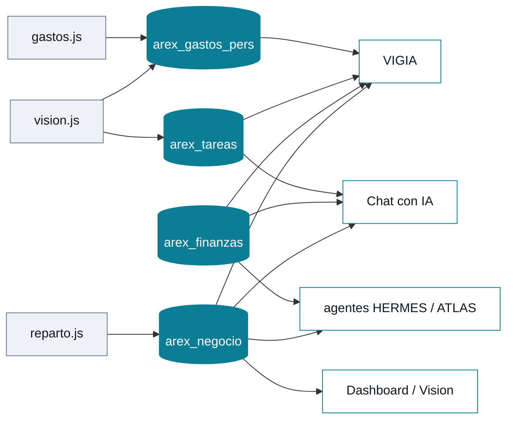

# AREX — Manual del sistema

> Mapa completo de qué tiene AREX, cómo se conecta entre sí, cómo sacarle uso real
> y qué se puede mejorar. **Cada dato salió del código, no de la memoria.**
>
> Versión documentada: **v208** · 33,571 líneas · 30 archivos JS · 14 módulos ·
> 5 agentes · 39 cruces de datos verificados · costo mensual: **$0**

---

## 1 · Qué tienes

Seis bloques temáticos. Todo en HTML, CSS y JavaScript puro: sin frameworks, sin
compilación, instalable como app y funcional sin internet.

### Núcleo de inteligencia
| Componente | Qué hace |
|---|---|
| Chat (GPT-OSS 120B) | Conversación con **todo tu contexto vivo** inyectado: finanzas, negocio, metas, tareas, memoria. Cascada automática a Llama-3.3 → 3.1 si un modelo se retira |
| `/profundo` (Gemini 2.5 Pro) | Razonamiento pesado bajo demanda. 10-30 s porque razona de verdad. Cuota diaria limitada → nunca se dispara solo |
| [`memoria.js`](memoria.js) | Memoria permanente + hechos que AREX aprende solo; se inyectan al prompt por relevancia |
| [`search.js`](search.js) | Búsqueda global (Cmd+K) sobre 8 fuentes simultáneas |

### Capital · el dinero
| Módulo | Qué hace |
|---|---|
| [`negocio.js`](negocio.js) | Frijol mayocoba: inventario en kg, ventas por medio litro, sucursales en contado o **consignación**, entregas con existencia por tienda y alerta de resurtido, meta mensual |
| [`reparto.js`](reparto.js) | Mapa 3D con tus tiendas. Registro de entregas desde el popup, **optimización del orden de paradas**, ruta solo-resurtir, navegación en Google Maps/Waze |
| [`finanzas.js`](finanzas.js) + [`finanzas-data.js`](finanzas-data.js) | Tarjetas, próximos pagos, simulador de liquidación, calculadora de 5 pestañas y **capital en la calle** (entregado sin cobrar) |
| [`gastos.js`](gastos.js) | Gasto personal por categoría vs presupuesto. Se alimenta también desde la cámara (foto del ticket) |

### Impulso · productividad
| Módulo | Qué hace |
|---|---|
| [`tareas.js`](tareas.js) | Prioridad, fecha, subtareas, recurrencia, orden automático por urgencia |
| [`metas.js`](metas.js) | Objetivos con progreso numérico o porcentual y fecha límite |
| [`agenda.js`](agenda.js) | Calendario que **agrega solo** tareas, recordatorios y metas |
| [`habitos.js`](habitos.js) | Hábitos diarios con racha y mini-calendario de 7 días |

### Mente · conocimiento
| Módulo | Qué hace |
|---|---|
| [`notas.js`](notas.js) | Notas con fijadas, colores y búsqueda; se crean también por voz |
| [`evidencias.js`](evidencias.js) | Respuestas de IA como registros permanentes. Cada corrida de agente deja tarjeta |
| [`proyectos.js`](proyectos.js) | Proyectos con fases que juntan por nombre sus tareas, metas y notas |

### Visión y AR
| Módulo | Qué hace |
|---|---|
| [`vision.js`](vision.js) | La cámara como interfaz: analiza, lee texto y recibos, identifica objetos. **Modo charla**: hablas normal, con memoria del hilo y acciones a media conversación |
| [`gesture.js`](gesture.js) | 5 señas configurables (✋ ✊ ☝ ✌ 👍), retícula orbital, swipes, pellizco |
| [`forja.js`](forja.js) | "Forja un dron" → la IA diseña el objeto 3D en vivo, anclado a tu espacio, manipulable con la mano |

### Control · centro de mando
| Componente | Qué hace |
|---|---|
| **VIGÍA** | Vigilancia proactiva que **cruza módulos** al abrir la app, sin que preguntes |
| **5 agentes** | HERMES (finanzas) · ATLAS (negocio) · SENTINEL (sistema) · SCRIBE (notas) · **ESPECTRO** (audita AREX desde adentro). Un botón los corre a todos |
| **Respaldo** | 24 claves exportables, sync a la nube, transferencia completa a otro dispositivo con un código |

---

## 2 · Cómo se conecta

**39 cruces de datos verificados en el código.** `arex_negocio` es el corazón:
casi todo lo consulta.

```mermaid
flowchart LR
  R[reparto.js]:::w --> N[(arex_negocio)]:::hub
  V[vision.js]:::w --> T[(arex_tareas)]:::hub
  V --> G[(arex_gastos_pers)]:::hub
  GA[gastos.js]:::w --> G
  N --> VG[VIGIA]:::c
  F[(arex_finanzas)]:::hub --> VG
  T --> VG
  G --> VG
  N --> AG[agentes HERMES / ATLAS]:::c
  F --> AG
  N --> IA[Chat con IA]:::c
  F --> IA
  T --> IA
  N --> D[Dashboard / Vision]:::c
  classDef hub fill:#0B7E96,stroke:#0B7E96,color:#fff
  classDef w fill:#eef1f5,stroke:#6B7A8F,color:#0F1720
  classDef c fill:#fff,stroke:#0B7E96,color:#0F1720
```

### Los cruces que más trabajan por ti

| Cruce | Qué hace |
|---|---|
| `reparto → negocio` | El popup de cada tienda muestra su existencia real y si necesita resurtido, calculado en vivo desde sus entregas y ventas (`negTiendaStats`) |
| `VIGÍA → 4 módulos` | Próximos pagos × margen × ventas de la semana → ¿te alcanza? · stock en kg × entregas del mes → ¿cubres el siguiente ciclo? |
| `negocio → finanzas` | Las ventas del mes suman a tu ingreso real; lo entregado sin cobrar aparece como capital en la calle |
| `visión → gastos` | Foto del ticket → gasto registrado en su categoría (`gpAddGastoAuto`) |
| `agenda → tareas + metas + recordatorios` | Un calendario armado de tres fuentes |
| `proyectos → tareas + metas + notas` | Cada proyecto junta por nombre lo relacionado |
| `control → todo` | Único módulo que escribe claves de todos los demás: respaldo, importación, sync forzada |

### Islas del sistema

- **`habitos.js`** — completamente aislado: ningún agente lo mira, no está en la
  búsqueda global ni en la agenda, y no expone getter para que otros lo consulten.
- **`agenda.js`** — no conoce hábitos, proyectos ni tus **pagos de tarjeta**, aunque
  `obtenerProximosPagos()` ya existe y encajaría como evento.
- **`search.js`** — no indexa negocio, reparto, hábitos, recordatorios ni memoria.

---

## 3 · Cómo usarlo de verdad

| Momento | Qué hacer |
|---|---|
| **Al despertar** (30 s) | Abre y lee. El VIGÍA ya revisó tus módulos: si algo es crítico te lo dice sin preguntar. El dashboard da negocio, finanzas, clima y pendientes de un vistazo |
| **Antes de repartir** | REPARTO → `🔥 SOLO RESURTIR` (solo tiendas que necesitan) → `⚡ OPTIMIZAR` (orden más corto, te dice cuántos km ahorras) → `▶ NAVEGAR` |
| **En la calle** | Toca la tienda en el mapa y registra la entrega ahí. Para gastos: foto del ticket. Con manos ocupadas: enciende el micrófono y **habla normal**, sin decir "AREX" |
| **Decisiones difíciles** | `/profundo <pregunta>` → Gemini 2.5 Pro con todo tu contexto. Medio minuto, pero razona en serio |
| **Semanal** (1 min) | CTRL → AGENTES → `⚡ BARRIDO TOTAL`. Los 5 agentes reportan a Evidencias; ESPECTRO audita el sistema por dentro |

**Tres atajos infrautilizados:** `Cmd+K` (busca en 8 fuentes) · decir
**"recuerda que…"** (guarda un hecho permanente) · `/hoy` (resumen del día).

---

## 4 · Uso real de cada módulo

Medido, no opinado. Tres preguntas a cada módulo:

1. **¿Alguien lee lo que escribe?** — se revisó el cuerpo de las 11 funciones
   consumidoras del sistema (contexto de la IA, dashboard, /hoy, reporte
   semanal, sincronización, VIGÍA, respaldo, búsqueda, VIERNES, agenda, HUD de
   visión), buscando tanto la clave de `localStorage` como los getters
   públicos. Un módulo que nadie consulta es adorno por bien hecho que esté.
2. **¿Él lee a otros?** — un módulo puede valer por consumir, no solo por
   producir. Control y Visión no guardan casi nada y son de los más útiles.
3. **¿AREX lo ve al conversar?** — la prueba más dura. Si no entra en el
   prompt, no puedes preguntarle por eso, y el módulo deja de ser parte del
   asistente para ser una pantalla suelta.

### Columna vertebral

| módulo | js+css | lectores | AREX lo ve |
|---|---|---|---|
| **Tareas** | 360 | **9 de 11** | sí |
| **Metas** | 764 | 8 | sí |
| **Gastos** | 615 | 7 | sí |
| **Finanzas** | 2.820 | 6 | sí |
| **Negocio** | 1.488 | 5 | sí |

Tareas es el módulo más conectado de AREX **y el más barato de los grandes**:
360 líneas sin CSS propio alimentando a nueve consumidores. Finanzas y Negocio
son los caros, pero son tu dinero: el margen, la deuda, el stock y las ventas.

### Herramientas — valen por lo que LEEN, no por lo que guardan

| módulo | js+css | lee de | nota |
|---|---|---|---|
| **Control** | 1.794 | **13 módulos** | el único sitio que ve el sistema entero |
| **Visión** | 4.113 | 7 módulos | el más caro de AREX, con diferencia |
| **VIERNES** | 244 | negocio, gastos | 244 líneas y ya alimenta al contexto de la IA y al VIGÍA |

Juzgar a Control o a Visión por "cuántos leen sus datos" sería un error: su
trabajo es consumir. Visión sí es la partida más cara del sistema —4.113
líneas, más que Finanzas— y conviene tenerlo presente.

### Reales pero infrautilizados

| módulo | js+css | lectores | el problema |
|---|---|---|---|
| **Notas** | 141 | 5 | excelente relación coste/uso, pero **AREX no las ve al conversar** |
| **Memoria** | 75 | 3 | 75 líneas alimentando el prompt: lo más rentable del sistema |
| **Proyectos** | 381 | 6 | lee tareas, metas y notas, pero el vínculo **solo funciona por coincidencia de nombre**: ninguna pantalla lo escribe |
| **Hábitos** | 635 | 5 | entra en el dashboard y en los informes, pero **AREX no lo ve** y no tiene agente |

### Lo que hoy está de adorno

| módulo | js+css | por qué |
|---|---|---|
| **Reparto** | **1.124** | 2 lectores, ninguno lo consulta de verdad, AREX no lo ve, y solo lee de Negocio. **La peor relación coste/valor del sistema.** |
| **Agenda** | 568 | **No guarda absolutamente nada propio** — la clave `arex_agenda` no existe. Es una vista sobre tareas + metas + recordatorios, y AREX tampoco la ve. Funcionalmente es una pestaña de Tareas, no un módulo. |
| **Evidencias** | 273 | Barato y correcto, pero solo se alcanza por la búsqueda. AREX no lo ve. |

### Qué ve AREX cuando le hablas

El prompt se arma con `buildSystemBase + buildContextSection + buildMemoriaSection
+ buildSessionMemorySection + buildModuleContext`. Entre todas, mencionan:

**Sí ve:** Finanzas · Negocio · Gastos · Metas · Tareas urgentes · Recordatorios ·
Proyectos · Memoria
**No ve:** Notas · Hábitos · Evidencias · Agenda · Reparto · capturas de Visión

Seis módulos existen, se llenan de datos y se sincronizan a la nube, pero **no
puedes preguntarle a AREX por ellos**. Ésa es la mayor pérdida de valor del
sistema, y es barata de arreglar: son unas pocas líneas dentro de
`buildModuleContext()`.

### Escalabilidad

Casi todos limitan cuántos registros dibujan. **Metas no**: dibuja todas sin
tope, así que se degradará según se acumulen. Negocio solo enseña los últimos
5 movimientos y Reparto los últimos 3 — ahí el problema es el contrario: con
datos de verdad se quedan cortos.

---

## 4 · Hoja de ruta

Estado real, verificado en el navegador. Lo tachado se comprobó, no se supone.

### v245 · Configurar el Quest con un enlace

- [x] **En el Quest nunca se podía pasar de la pantalla de claves.** Había que
      escribir `gsk_…` y siete campos de Firebase con el teclado virtual, o
      pegar un código copiado en otro dispositivo — y el iPhone y el Quest no
      comparten portapapeles. Ahora: iPhone → `/config` → **ENVIAR ENLACE AL
      QUEST** → te lo mandas por correo o WhatsApp → en el Quest solo se toca.
      El código viaja en el fragmento `#arex=` (nunca llega al servidor) y se
      borra de la barra al leerse. El cuadro de importar acepta también el
      enlace pegado.
- [x] Un enlace dañado deja la pantalla de claves con un aviso claro, sin
      tumbar el arranque (`history` es el historial del chat en `app.js`;
      se usa `window.history`).

### v244 · Hologramas 3D en el modo AR

- [x] **Tres hologramas volumétricos** junto a los paneles AR del Quest
      (`hologramas.js`, cargado bajo demanda desde `webxr.js`): el núcleo de
      AREX proyectado desde una base de luz, las **ventas del negocio de los
      últimos 7 días** en barras 3D, y las **metas activas** como anillos de
      progreso. Se agarran con el gatillo o pellizco y se mueven. Si el
      archivo falla, los paneles siguen funcionando.
- [x] **El panel de Metas del AR nunca mostró porcentajes**: leía
      `m.progreso`, un campo que Metas nunca guardó. Ahora usa
      `valorActual / valorObjetivo`, igual que el módulo.
- [ ] Probado en navegador con datos sembrados (alturas y % contra cálculo a
      mano). **Falta probarlo dentro de una sesión AR real en el Quest.**

### Hecho entre v213 y v220

**Bugs de datos, cerrados de raíz**
- [x] **La fecha.** 32 sitios en 12 archivos calculaban "hoy" con
      `toISOString()`, que es UTC. México va seis horas atrás, así que **a
      partir de las 18:00 todo se guardaba en el día siguiente**: una venta
      al cerrar el local, un hábito marcado de noche, el briefing del día.
      Ahora `hoy()` / `dia()` / `mes()` en `nucleo.js`. *(v216)*
- [x] **Sincronizar dejó de ser opcional.** 12 módulos tenían que acordarse
      de llamar a `arexSyncData` después de guardar. Olvidarlo dejó sin subir
      a reparto (v205), finanzas (v206) y visión (v208). Ahora va dentro de
      `guardar()`. *(v217)*
- [x] **44 diálogos nativos fuera.** `alert`/`confirm`/`prompt` se suprimen en
      la PWA de iOS. En `proyectos.js` la confirmación estaba dentro del
      `onclick`, así que el proyecto se borraba **sin preguntar**. *(v216)*
- [x] **La búsqueda global nunca encontraba tareas**: indexaba `texto` y el
      campo se llama `text` desde v208. *(v217)*
- [x] Los gastos de NEGOCIO ya cuentan en el margen real. *(v209)*
- [x] Una sola fuente de verdad para la existencia por tienda
      (`negExistenciaTienda`). *(v207)*

**Rendimiento**
- [x] **De 120 rAF/s a 0** en el dashboard. Fuera el campo de estrellas, las
      partículas y la rejilla hexagonal (dos canvas a pantalla completa), y
      fuera el tilt 3D, que se mantenía al día con un `MutationObserver`
      sobre TODO el documento — cada render de cualquier lista lo disparaba,
      y en el iPhone no hay cursor, así que nunca se vio. El orbe se queda
      pero se apaga cuando sale de pantalla. *(v215)*
- [x] CSS al arrancar: 421 → 327 KB. 303 clases muertas, 405 reglas, 24
      variables, 20 `@keyframes` y `reactor3d.*` entero. *(v218)*

**Estructura**
- [x] `nucleo.js` — la base común que no existía. *(v216)*
- [x] `widgets.js` — 579 líneas fuera de `app.js`, sin una sola dependencia
      cruzada. *(v219)*
- [x] `vision.css` — 1.060 líneas que se analizaban en cada arranque para un
      panel que solo existe al abrir la cámara. *(v218)*
- [x] `diseno.css` — sistema de diseño en CSS moderno: oklch, anidamiento
      nativo, `@container`, `:has()`. INICIO migrado. *(v220)*

### Hecho entre v221 y v231

- [x] **Accesibilidad en los 14 módulos** — y el contrato que la medía tenía
      **tres errores** que daban "limpio" cuando no lo estaba: selector del
      panel visible obsoleto, los `<path>` de los SVG contados como objetivos
      táctiles (141 en vez de 7), y los números de `oklch(0.19 …)` leídos como
      canales RGB. *(v221)*
- [x] AREX ve hábitos, notas fijadas y reparto en su contexto. *(v222)*
- [x] Reparto: **mapa a pantalla completa** con los datos encima, y ruta a
      Google Maps por tramos de 11 paradas. *(v223)*
- [x] **Mapa vectorial** y capa de tráfico si hay clave de TomTom. *(v224)*
- [x] Las fuentes se alojan aquí; nada de Google Fonts al arrancar. *(v225)*
- [x] NEGOCIO, Gastos, Metas, Proyectos y Evidencias al sistema de diseño,
      borrando sus reglas viejas en el mismo commit. *(v226, v227)*

**Y la parte que salió mal, que también es historia**

- [~] v228 y v229 añadían botón de ver, PEGAR y PROBAR a los campos de clave.
      Todo verde en Chromium; **en su iPhone dejaron la pantalla en negro**.
      Revertidos enteros. *(v230)*
- [x] **Red de seguridad.** Una pantalla en negro era un callejón: el botón de
      forzar actualización vive DENTRO de la app que no arranca. Ahora hay un
      vigilante que avisa a los 15 s, una escotilla de **dos dedos apoyados
      dos segundos** que abre el rescate aunque la app crea que arrancó, y
      **`rescate.html`**, una página sin ninguna dependencia que se dibuja
      pase lo que pase y enseña qué hay instalado de verdad. *(v230, v231)*
- [x] **El cristal nace apagado.** v225 lo encendió por primera vez en su
      iPhone —antes la detección de "equipo flojo" lo apagaba en todo
      navegador que no publicara sus núcleos, que es el caso de Safari— y
      desde entonces AREX no arranca ahí. Hay **63 declaraciones de
      `backdrop-filter`** apiladas, y en WebKit eso es un modo de fallo
      conocido. No se puede comprobar aquí: este entorno solo tiene Chromium.
      Se deja de encender por defecto algo que no se puede probar donde
      corre. Encendido: `arexEfectos('on')`. *(v231)*

### v246 · La pantalla de cuenta deja de ser un callejón

- [x] **Si el login de Google no podía completarse, quedabas fuera de tu
      propia app.** Esa pantalla solo tenía el botón de Google: sin salida,
      con todos tus datos intactos en el teléfono y sin forma de verlos. Y en
      la app instalada del iPhone ese login **no puede completarse**: Firebase
      hace el login en una página suya (`…firebaseapp.com`) y AREX vive en
      otro dominio, así que iOS separa el almacenamiento de cada uno y la
      página auxiliar no encuentra el dato que AREX dejó — el "missing initial
      state" de la captura. Ahora hay **SEGUIR SIN CUENTA**: AREX funciona
      entera, los datos se guardan en el dispositivo, y la cuenta se vincula
      después desde `/config`. La elección se recuerda.
- [x] La salida se cablea **aparte de Firebase**. El botón de Google se
      conecta dentro de `initFirebase()`, que es justo lo que falla sin red;
      si en ese estado algo enseñaba la pantalla, ningún botón respondía.
- [x] El error de Firebase salía crudo (`auth/internal-error: Unable to
      process request…`). Ahora se traduce y apunta a las dos salidas reales:
      entrar desde Safari o seguir sin cuenta.

**Pendiente de decisión (no es código):** la solución de raíz al login es que
AREX y el dominio de autenticación sean el mismo — es decir, servirla desde
Firebase Hosting (`arex-96aab.web.app`) en vez de GitHub Pages. Requiere
credenciales de despliegue del dueño.

### v247 · El vínculo proyecto ↔ tarea vuelve a existir

- [x] **Desde v241 todos los proyectos salían con cero tareas.** Aquella
      versión quitó la asociación por parecido de nombre —con razón: un
      proyecto llamado "Casa" se tragaba "Comprar casaca"— y dejó mandando el
      vínculo explícito `tarea.proyecto`. Pero **ninguna pantalla escribía ese
      campo**, así que el progreso quedó en 0 % para todos. Ahora el parecido
      vuelve como **sugerencia**: se enseña aparte, no cuenta, y con un toque
      en VINCULAR pasa a explícito para siempre.
- [x] *(Lección de método: la prueba de v241 pasó porque sembraba una tarea
      con `proyecto:'Casa'` escrito a mano, datos que la app no puede
      producir. Probar con datos imposibles es no probar.)*

### v248 · Preparado el traslado a Firebase Hosting, y la VAPID key deja de ser invisible

- [x] **`firebase.json`, `.firebaserc` y un flujo de GitHub Actions** que
      publica AREX también en `arex-96aab.web.app`. Mientras no exista el
      secreto `FIREBASE_SERVICE_ACCOUNT`, el flujo se salta solo y GitHub
      Pages sigue igual: no rompe nada.
- [x] **El `authDomain` se ajusta al sitio que sirve AREX.** `web.app` y
      `firebaseapp.com` son dominios distintos aunque los sirva el mismo
      proyecto; abrir la app en uno con el `authDomain` apuntando al otro
      dejaría el login igual de partido. Si AREX se sirve desde un dominio de
      Firebase, el `authDomain` pasa a ser ese mismo.
- [x] **Las notificaciones con la app cerrada eran una caja negra.**
      `initFCM()` sale por la puerta de atrás si falta la VAPID key, y si la
      clave está mal, Firebase lanza y el error muere en un `console.warn`
      que en un iPhone no ve nadie: creías tener avisos y no los tenías.
      Ahora `/config` dice el estado real (falta la clave · no tiene la forma
      esperada · Firebase la rechazó · activas), se valida el formato al
      guardar (`B` + 87 caracteres base64url) y el fallo de FCM se enseña.

### Lo siguiente, por orden

Medido hoy en el navegador, no heredado de la hoja anterior:

- [ ] **[ALTA · decisión del dueño]** El login de Google **no puede
      completarse en la app instalada del iPhone**: Firebase autentica en
      `…firebaseapp.com` y AREX vive en `github.io`, así que iOS separa el
      almacenamiento y la página auxiliar no encuentra el estado. Desde v246
      hay salida (SEGUIR SIN CUENTA), pero la cura de raíz es servir AREX
      desde **Firebase Hosting**, donde app y dominio de autenticación
      coinciden. Requiere credenciales de despliegue del dueño.
- [ ] **[ALTA · diseño]** Propagar `diseno.css` a lo que falta: **Finanzas,
      Tareas, Notas, Agenda, Hábitos, Control y Chat**, más el grueso de
      `style.css` (6.048 líneas, siete pasadas de rediseño apiladas). Ya
      migrados: Inicio, Negocio, Gastos, Metas, Proyectos, Evidencias.
- [ ] **[MEDIA · conexión]** La agenda no muestra los pagos de tarjeta,
      aunque `obtenerProximosPagos()` existe y funciona.
- [ ] **[MEDIA · conexión]** La búsqueda global no indexa **negocio** ni
      **reparto** —los dos módulos con más datos— ni las subtareas.
      (Tareas, notas, metas, proyectos, gastos, hábitos, recordatorios,
      evidencias, memoria y bitácora sí, desde v240.)
- [ ] **[BAJA · estructura]** `app.js` son 5.441 líneas. Lo que queda —motor
      de chat, comandos, arranque, sesión— está entrelazado de verdad;
      seguir partiéndolo con globales de `window` empeoraría el acoplamiento.
      El camino es convertirlo a módulos ES con `import`.

**Cerrados desde la hoja anterior, comprobados hoy:** los objetivos táctiles
por debajo de 44 px (medidos: **0 en los 14 módulos**), los desbordes
horizontales (**0 reales**; los nueve que aparecían eran tiras de pestañas
deslizables, un patrón válido), el cristal que se apagaba solo (v225) y luego
se retiró por costoso (v239), y las fuentes fantasma `Exo 2` / `JetBrains
Mono` (v225).

---

## Método de verificación

Todo lo documentado se comprueba en un navegador real (Chromium + Playwright,
offline, sin gastar APIs) recorriendo AREX como usuario: clicks reales, datos de
prueba, medición de resultados numéricos contra valores calculados a mano.

Desde v213 hay dos contratos automáticos, y son distintos a propósito:

**Contrato de refactor** — para cambios que NO deben alterar el aspecto.
Captura 30 propiedades de estilo y el rectángulo de ~450 elementos en los 14
módulos, antes y después. El umbral es **0 diferencias reales**; solo se
admiten las de fase de animación, que se reconocen porque cambian en la tercera
cifra decimal o en 1 px. Es lo que hizo seguro colapsar 205 selectores y borrar
303 clases sin mover un píxel.

**Contrato de rediseño** — para cambios que SÍ deben cambiar el aspecto, donde
exigir "estilo idéntico" no tendría sentido. Mide que sea correcto: contraste
WCAG calculado sobre el color realmente pintado (subiendo por los padres hasta
hallar un fondo opaco), objetivos táctiles de 44 px contando los `::before` que
amplían el área, desbordes horizontales y solapes entre tarjetas.

Más las suites por función: núcleo (17), sincronización (15), widgets (8) y el
panel de visión abierto de verdad con una cámara falsa de Chromium.
